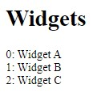

# install

```bash
pnpm i
pnpm dev
```

# review

`src/routes/index.svelte`:

```svelte
<script context="module">
	import WidgetSelector from '$lib/WidgetSelector.svelte';
	import type { LoadOutput } from '@sveltejs/kit/types/page';
	export const load = (): LoadOutput => {
		return {
			props: {
				widgets: ['WidgetA', 'WidgetB', 'WidgetC']
			}
		};
	};
</script>

<script>
	export let widgets: string[];
</script>

<h1>Widgets</h1>
{#each widgets as widget, index}
	<div>{index}: <WidgetSelector {widget} /></div>
{/each}
```

`src/lib/WidgetSelector.svelte`:

```svelte
<script lang="ts">
	export let widget: string;
	const loadWidget = async (widget: string) => {
		switch (widget) {
			case 'WidgetA':
				return await import('$lib/WidgetA.svelte');
			case 'WidgetB':
				return await import('$lib/WidgetB.svelte');
			case 'WidgetC':
				return await import('$lib/WidgetC.svelte');
		}
	};
</script>

{#await loadWidget(widget) then c}
	<svelte:component this={c.default} />
{/await}
```

# client side result:



# server side result:

```html
<div>0: </div><div>1: </div><div>2: </div>
```
